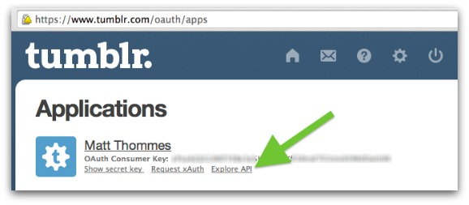
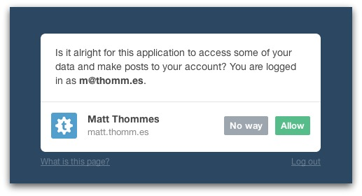
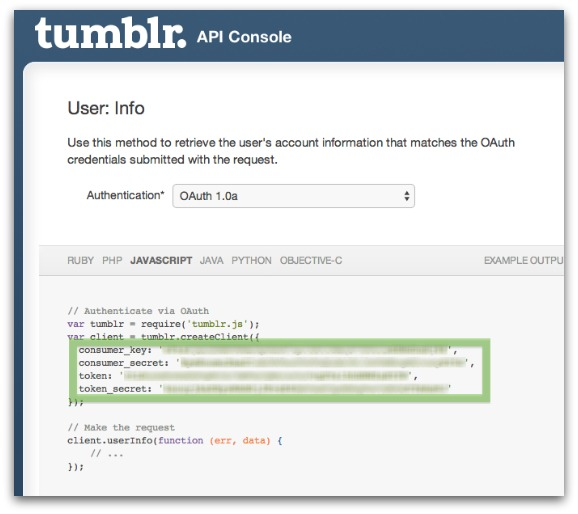

Tumblr API scripts
==========

Scripts that interact with the Tumblr API.

## Installation

To get started, create a file called `auth_tokens.php` and put it in the same directory as the `fetch_posts.php` file (from this repository). The contents of `auth_tokens.php` should be

	<?php

		$consumer_key = "";
		$consumer_secret = "";
		$token = "";
		$token_secret = "";

	?>

The consumer values are for your [registered application on Tumblr](https://www.tumblr.com/oauth/apps). The token values are found after you authorize your application to have access to your Tumblr account.

Click "Explore API":

You'll then be taken to a page where you grant permission for your application to access your Tumblr account:

When you click "Allow" you land on a page where you can grab the values:

### fetch_posts.php

This script will fetch all blog posts from any blog you have access to.

Put the name of your blog in (for whatever posts your want to fetch) in the `fetch_posts.php` script:

	$blog_name = "your-blog";